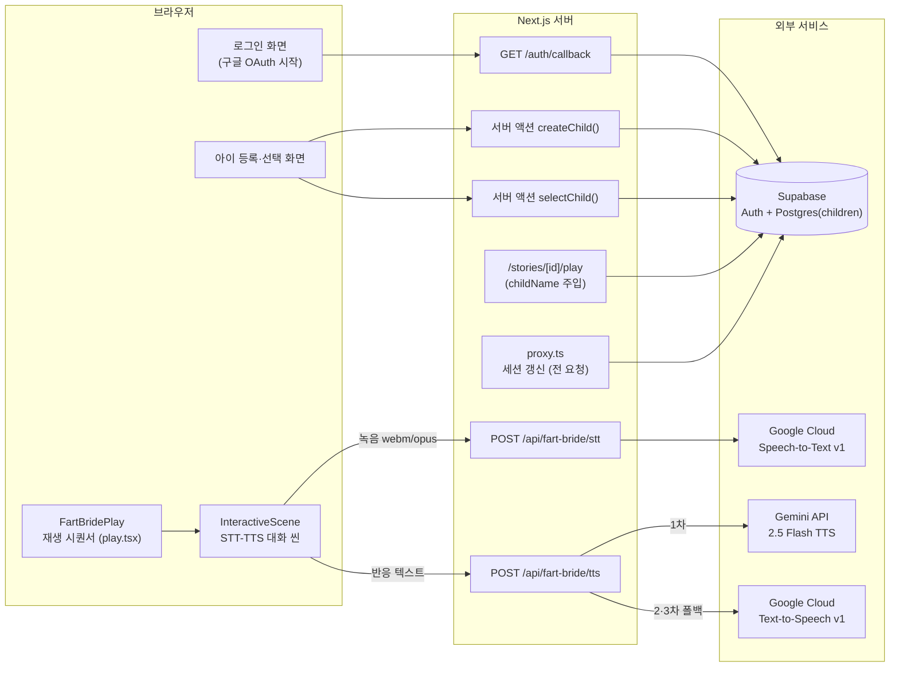
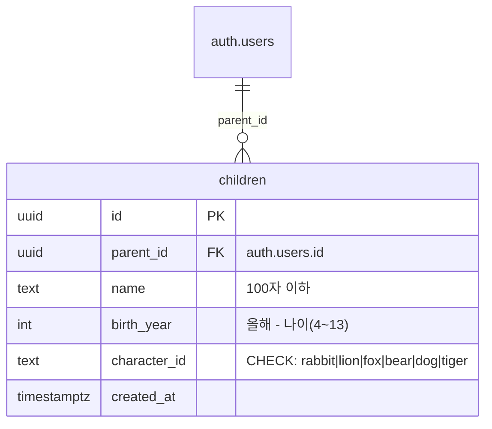
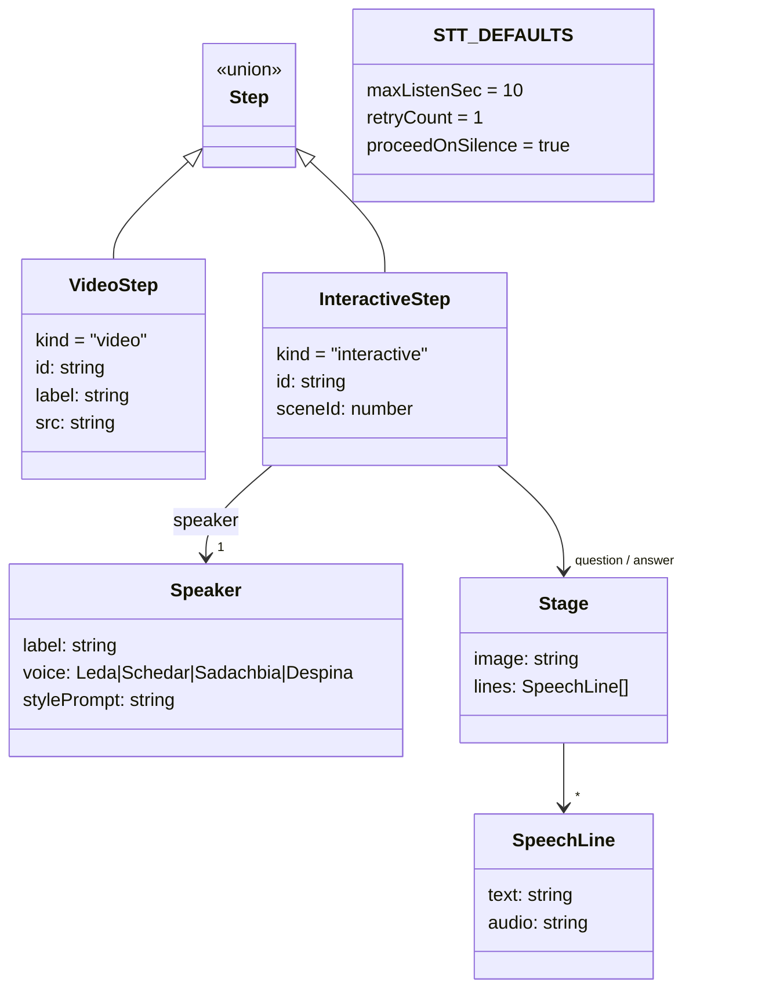
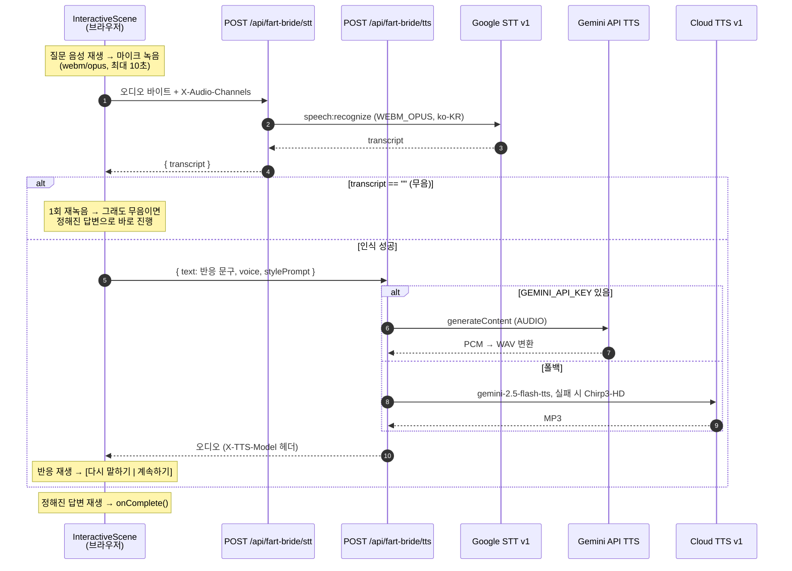
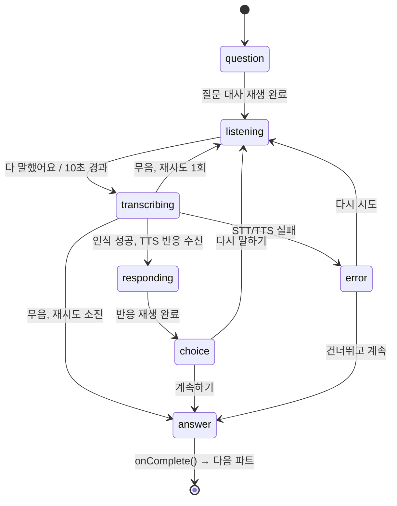

# 좋은질문 API 명세서

> 기준: `api_team` 브랜치, 2026-08-13. Next.js App Router 기반.
> HTTP 라우트 핸들러 3개 + 서버 액션 2개 + 프록시(미들웨어) 1개가 전부다.

## 전체 구조 (컴포넌트 다이어그램)

---

## 1. HTTP API

### 1.1 `POST /api/fart-bride/stt` — 아이 음성 → 텍스트

브라우저 MediaRecorder 녹음(webm/opus)을 그대로 받아 Google Cloud
Speech-to-Text v1 로 인식한다. Google API 키는 서버 환경 변수에만 있다.

**요청**

| 항목 | 값 |
|---|---|
| Content-Type | `application/octet-stream` |
| Body | webm/opus 오디오 바이트 (MediaRecorder 산출물 그대로) |
| `X-Audio-Channels` 헤더 | 마이크 채널 수. 없거나 숫자가 아니면 `1` |

채널 수 헤더가 필요한 이유: 스테레오 마이크에서 opus 헤더와 STT config 의
채널 수가 어긋나면 구글이 400 을 반환한다. 클라이언트가
`MediaStreamTrack.getSettings().channelCount` 를 읽어 보내 준다.

**STT 설정(서버 고정값)**: `encoding: WEBM_OPUS`, `languageCode: ko-KR`,
`maxAlternatives: 1` (아이 발화는 짧아 최상위 후보만 사용).

**응답**

| 상태 | Body | 의미 |
|---|---|---|
| 200 | `{ "transcript": string }` | 인식 결과. **무음이면 `""`** — 에러가 아니라 클라이언트가 재시도를 판단한다 |
| 400 | `{ "error": string }` | 녹음 데이터가 비어 있음 |
| 500 | `{ "error": string }` | `GOOGLE_CLOUD_API_KEY` 미설정 |
| 502 | `{ "error": string, "detail": string }` | 구글 STT 호출 실패 (detail 은 구글 원문) |

무음 처리 규약(`STT_DEFAULTS`): 최대 청취 10초, 무음 재시도 1회, 그래도
무음이면 정해진 답변으로 진행(`proceedOnSilence`).

---

### 1.2 `POST /api/fart-bride/tts` — 텍스트 → 캐릭터 음성

캐릭터 보이스로 음성을 합성해 오디오 바이너리로 반환한다.
세 단계 폴백 체인으로, 어느 경로였는지는 응답 헤더 `X-TTS-Model` 로 알 수 있다.

**요청** (`Content-Type: application/json`)

| 필드 | 타입 | 필수 | 설명 |
|---|---|---|---|
| `text` | string | O | 합성할 문장. 공백뿐이면 400 |
| `voice` | string | X | `Despina` \| `Leda` \| `Schedar` \| `Sadachbia`. 목록 밖 값은 `Despina` 로 대체 |
| `stylePrompt` | string | X | 말투 연기 지시. **Gemini 계열(1·2차)만 반영**, Chirp3-HD 는 무시 |

보이스는 story_database.json 의 성우 매핑과 같다:
내레이션=Despina, 며느리=Leda, 시아버지=Schedar, 이장님=Sadachbia.

**폴백 체인**

| 순서 | 경로 | 조건 | 응답 포맷 | `X-TTS-Model` |
|---|---|---|---|---|
| 1차 | Gemini API `gemini-2.5-flash-preview-tts` | `GEMINI_API_KEY` 설정 시 | `audio/wav` (PCM 16bit mono → WAV 헤더) | `gemini-api-2.5-flash-tts` |
| 2차 | Cloud TTS의 Gemini-TTS | 1차 실패·미설정 시 (Vertex 권한 필요) | `audio/mpeg` (MP3) | `gemini-2.5-flash-tts` |
| 3차 | Cloud TTS `ko-KR-Chirp3-HD-<voice>` | 2차 실패 시 (항상 동작하는 안전망) | `audio/mpeg` (MP3) | `chirp3-hd-fallback` |

**응답**

| 상태 | Body | 의미 |
|---|---|---|
| 200 | 오디오 바이너리 | 위 표의 포맷. 헤더로 경로 확인 |
| 400 | `{ "error": string }` | `text` 가 비어 있음 |
| 500 | `{ "error": string }` | `GOOGLE_CLOUD_API_KEY` 미설정 |
| 502 | `{ "error": string, "detail"?: string }` | 모든 경로 실패, 또는 응답에 오디오 없음 |

---

### 1.3 `GET /auth/callback` — 구글 OAuth 착지점

Supabase PKCE 코드를 세션 쿠키로 교환한 뒤 리다이렉트한다.

**쿼리 파라미터**

| 파라미터 | 설명 |
|---|---|
| `code` | Supabase 가 넘겨주는 PKCE 인증 코드 |
| `next` | 성공 후 이동할 경로. **같은 오리진의 절대경로만 허용** (`/` 시작, `//` 금지 — 오픈 리다이렉트 방지). 기본값 `/children` |
| `error`, `error_description` | 사용자가 구글 동의 화면에서 취소한 경우 등 공급자 에러 |

**동작**: 항상 리다이렉트로 끝난다.
성공 → `{origin}{next}` / 실패(공급자 에러, code 없음, 교환 실패) →
`/login?error=<메시지>`.

---

## 2. 서버 액션 (React Server Actions)

REST 엔드포인트가 아니라 Next 의 폼 액션으로 호출된다. 화면에서 막은 값도
폼을 우회해 직접 POST 될 수 있으므로 서버에서 전부 재검증한다.
두 액션 모두 미로그인 시 `/login` 으로 redirect.

### 2.1 `createChild(prev, formData)` — 아이 등록

`src/app/onboarding/child/actions.ts`

| FormData 필드 | 검증 |
|---|---|
| `name` | 필수, 100자 이하 |
| `age` | 정수 4~13 (연 나이) |
| `characterId` | `rabbit` \| `lion` \| `fox` \| `bear` \| `dog` \| `tiger` (DB CHECK 제약과 동일 목록) |

성공: `children` 에 `{ parent_id: user.id, name, birth_year: 올해 - age, character_id }`
insert → `/children` revalidate 후 redirect.
실패: `{ error: string }` 반환 (폼 상태로 표시).

### 2.2 `selectChild(childId)` — 플레이할 아이 선택

`src/app/children/actions.ts`

내 아이인지 확인(`parent_id = user.id`, RLS 이중 방어) 후
`selected_child` 쿠키(httpOnly, SameSite=Lax, 30일)에 아이 id 를 담고
`/home` 으로 redirect. 남의 아이 id 면 쿠키를 건드리지 않고 그냥 redirect.

이 쿠키는 재생 화면(`/stories/[id]/play`)이 대화 씬에서 아이 이름을 부를 때
읽는다 — 쿠키가 없거나 남의 아이면 첫 아이, 그마저 없으면 이름 없이 진행.

---

## 3. 공통 인프라

### 3.1 `proxy.ts` (구 middleware)

정적 자산을 제외한 모든 요청에서 Supabase 세션을 갱신한다
(`auth.getUser()` 1회 왕복). 만료된 액세스 토큰의 갱신분을 응답 쿠키로
실어 보낼 수 있는 유일한 지점. 세션 쿠키가 실린 응답에는 no-store 계열
캐시 헤더를 붙인다. **인증을 강제하지는 않는다** — 차단 없이 통과시키며,
보호는 각 페이지·액션의 `getUser()` 검사와 RLS 가 담당한다.

> 참고: STT·TTS 라우트는 현재 로그인 검사가 없다. 키가 서버에만 있어
> 유출 위험은 없지만, 공개 배포 전에는 세션 검사나 rate limit 을 붙일 것.

### 3.2 쿠키

| 쿠키 | 쓰는 곳 | 속성 |
|---|---|---|
| `sb-*` (Supabase 세션) | `@supabase/ssr` 자동 관리, proxy 가 갱신 | httpOnly |
| `selected_child` | `selectChild()` 가 쓰고 재생 화면이 읽음 | httpOnly, Lax, 30일 |

### 3.3 환경 변수

| 변수 | 용도 |
|---|---|
| `GOOGLE_CLOUD_API_KEY` | STT·TTS 필수 (서버 전용) |
| `GEMINI_API_KEY` | TTS 1차 경로(AI Studio 키). 없으면 2차부터 시도 |
| `NEXT_PUBLIC_SUPABASE_URL` | Supabase 프로젝트 URL |
| `NEXT_PUBLIC_SUPABASE_PUBLISHABLE_KEY` | Supabase 공개 키 |

---

## 4. 데이터 모델

### 4.1 DB — `children` (Supabase Postgres, RLS)

### 4.2 이야기 재생 타입 (`src/stories/fart-bride/data.ts`)

`SEQUENCE` 는 `part1 → scene4 → part2 → scene7 → part3 → scene10 → part4
→ scene16 → part5` 순서의 `Step[]` — 영상 5파트 사이에 대화 4씬이 끼어든다.

---

## 5. 대화 씬 동작

### 5.1 시퀀스 다이어그램 — STT→TTS 1회 순환

반응 문구는 현재 고정 템플릿(`buildReaction`)이다 — LLM 순환 구조가 정해지면
이 지점이 LLM 호출로 바뀐다.

### 5.2 상태 다이어그램 — `Phase`

---

## 6. 화면 라우트 (참고)

| 경로 | 성격 | 비고 |
|---|---|---|
| `/` | 랜딩 | |
| `/login` | 로그인 | 구글 OAuth 시작 (`signInWithOAuth`) |
| `/auth/callback` | 라우트 핸들러 | §1.3 |
| `/onboarding/child` | 아이 등록 폼 | `createChild` 액션 |
| `/children` | 아이 선택 | `selectChild` 액션 |
| `/home`, `/stories` | 메인 탭 | `(main)` 레이아웃 |
| `/stories/[id]` | 이야기 소개 | |
| `/stories/[id]/play` | 재생 화면 | id 로 스토리 컴포넌트 매핑, `childName` 주입 |
